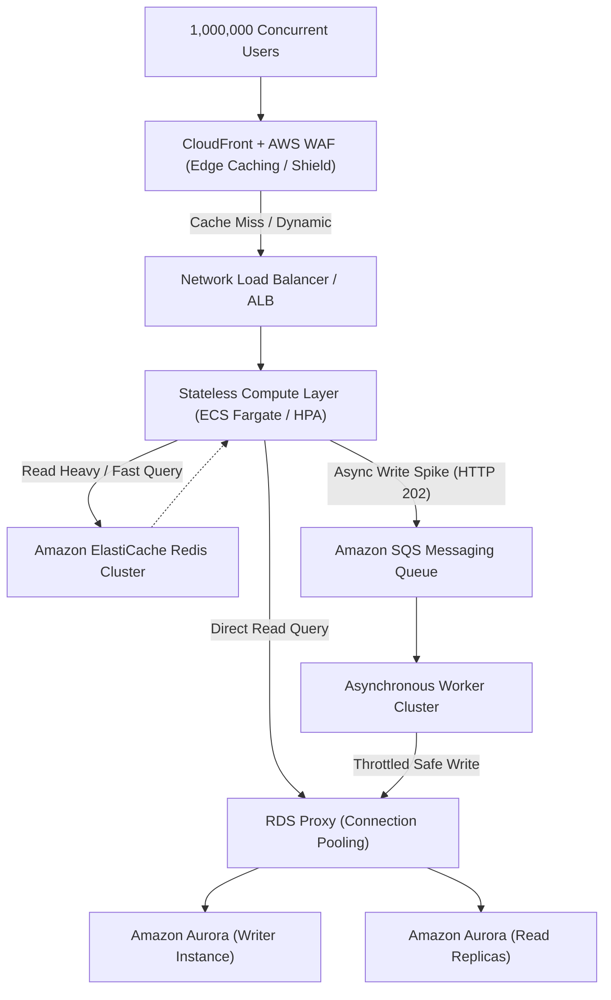

# Million-Scale-Resilient-Infra 🛡️⚡

> **「100万人が同時にアクセスしても落ちない」** ―― すべてのリクエストをオリジンへ到達させず、書き込みを非同期化してさばき切る、ファンネル（漏斗）型超スケーラブル・エンタープライズ・クラウド基盤。

---

## 📖 プロジェクト概要

本リポジトリは、100万人規模の瞬間スパイク・継続アクセスに耐え抜くためのAWSインフラストラクチャを、Terraformにより完全コード化したエンタープライズ級IaCプロジェクトです。

### 🏗️ アーキテクチャの要諦
1. **エッジ層での徹底フィルタリング (CloudFront + AWS WAF):** 最大80〜90%のトラフィックをエッジキャッシュで即時返却。スパイクをオリジン手前で消滅させます。
2. **超低遅延負荷分散 (NLB / ALB):** L4/L7の多段負荷分散により、毎秒数十万規模のリクエストを平滑化して転送。
3. **ステートレス・コンテナ (ECS Fargate / EKS):** アプリケーション層は完全ステートレスとし、CPU/メモリのみならずキュー長・トラフィック連動で瞬時にオートスケール。
4. **分散キャッシュ (ElastiCache Redis Cluster):** ホットリードやセッション情報をインメモリで防衛し、データベース問い合わせを最小化。
5. **非同期書き込みパイプライン (SQS / Worker):** 大量書き込みスパイクをメッセージキューで即時受付（HTTP 202）、後続ワーカーにより安全な速度で整流化。
6. **耐障害DB層 (Aurora + RDS Proxy):** コネクション枯渇をRDS Proxyで防ぎ、CQRSパターンによる参照/更新の分離を実現。

---

## 🗺️ インフラ構成図 (Architecture)



---

## 📂 ディレクトリ構成

```text
.
├── envs/
│   ├── prod/
│   │   ├── main.tf
│   │   ├── variables.tf
│   │   └── terraform.tfvars
│   └── stg/
├── modules/
│   ├── cdn_waf/          # CloudFront + WAF + Shield 設定
│   ├── load_balancer/    # NLB / ALB リスナー設定
│   ├── compute/          # ECS Fargate クラスター & HPA
│   ├── cache/            # ElastiCache Redis Cluster
│   ├── messaging/        # Amazon SQS デッドレターキュー設定
│   └── database/         # Aurora Cluster & RDS Proxy
└── README.md
```

---

## 🚀 デプロイ手順

### 前提条件
- Terraform >= 1.5.0
- AWS CLI configured with appropriate permissions

### 実行ステップ
```bash
# 1. リポジトリのクローン
git clone https://github.com/code-refinery-works/Million-Scale-Resilient-Infra.git
cd Million-Scale-Resilient-Infra/envs/prod

# 2. 初期化
terraform init

# 3. 実行計画の確認
terraform plan

# 4. インフラのプロビジョニング
terraform apply -auto-approve
```

---

## 🎭 キャスト（制作エンドロール）

- agent🔵 **Concept & Requirements Definition:** 100万人耐久アーキテクチャ・ファンネル構想の策定
- agent🍇 **System Architecture & Review:** 障害点ゼロ設計・耐障害レビュー
- agent🍊 **Infrastructure as Code Implementation:** Terraformモジュール高速実装 & 最適化
- agent🟢 **QA & Verification:** セキュリティルール監査、構文・接続テスト検証
